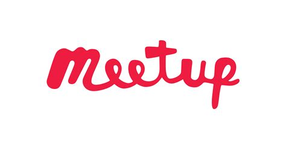

# Kotlin Valencia

Kotlin Valencia es el lugar para reunirse cada mes para hablar, compartir y aprender sobre Kotlin y su ecosistema.

Functional Kotlin, Spring Boot, Micronaut, Quarkus, Microservices with Kotlin, Kotlin in Android, KMM, son algunos de los temas que podrás encontrar.

## ¿Cómo organizar una Meetup?

Haznos saber que estás interesada/interesado en organizar una meetup vía [Discord][discord] o [Meetup][meetup] con:

- Nombre de la charla
- Tipo de charla
- Lugar donde se va a hacer. Puedes ver los [Venues](./Venues.md) que tenemos disponibles, aunque se puede hacer en cualquier lugar de Valencia sin necesidad de estar listado.

## Tipos de Meetups para inspirarte

1. Live coding
2. Workshop (practical/hands-on)
3. Panel/Open discussion, questions & answers (Q&A) or fishbowl conversations
4. Talk

[Más info aquí](./Formats.md)

## Links interesantes

https://www.meetup.com/es-ES/kotlin-valencia/

https://discord.gg/d4Wj3JFTVQ

## Code of Conduct

Kotlin Valencia Meetup is dedicated to providing a harassment-free Meetup experience for everyone [, regardless of gender, gender identity and expression, sexual orientation, disability, physical appearance, body size, race, age or religion [insert any other specific concerns here]]. We do not tolerate harassment of Meetup participants in any form. [Sexual language and imagery is not appropriate for any Meetup venue, including talks.] Meetup participants violating these rules may be sanctioned or expelled from the Meetup [without a refund] at the discretion of the Meetup organizers. Our anti-harassment policy can be found at:

[CODE_OF_CONDUCT.md](./CODE_OF_CONDUCT.md)

[meetup]: https://www.meetup.com/es-ES/kotlin-valencia/
[discord]: https://discord.gg/d4Wj3JFTVQ
